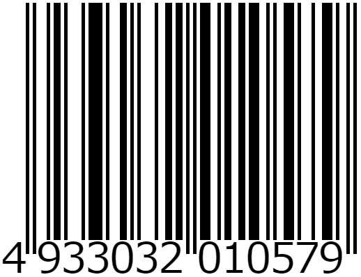

# JAN code

## What is JAN code

Officially called **Japanese Article Number**, it is a Barcode.  
Internationally, it is called **EAN code**(European Article Number).  
For more information on JAN code, please visit the Wikipedia.
<https://en.wikipedia.org/wiki/International_Article_Number>

## Example

## What is this repository?

Projects to generate JAN code in various programming languages.  
Below is a list of currently supported programming languages.

- [Python](/python/README.md)
